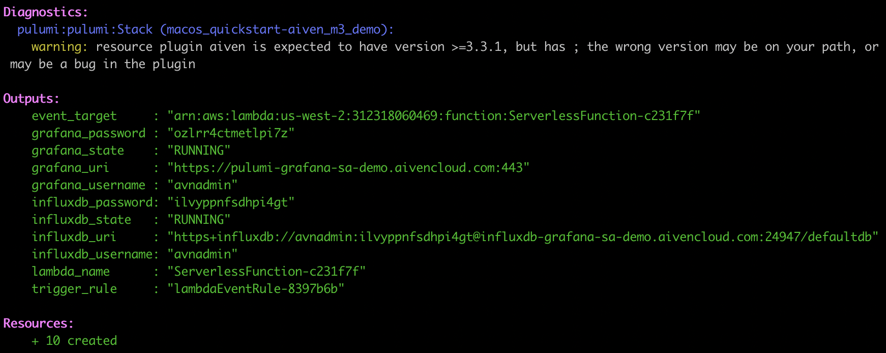
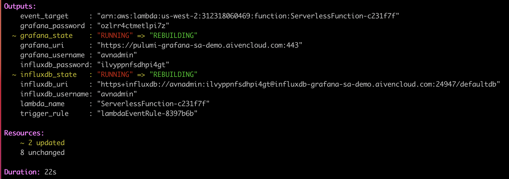

# Using Pulumi + Aiven InfluxDB + AWS Lambda

## Overview

This demo will deploy the following infra:

- Grafana instance on Aiven
- InfluxDB database instance on Aiven (currently in beta)
- Service integration between InfluxDB > Grafana
- AWS Lambda Layer for the [InfluxDB Python Client](https://github.com/influxdata/influxdb-python) library
- AWS Lambda function and associated role
- AWS EventBridge trigger to execute the Lambda function every 60s

## Requirements

- [Python](https://www.python.org/downloads/) 3.7+
- [AWS CLI](https://aws.amazon.com/cli/) 2.0+
- [Pulumi](https://www.pulumi.com/docs/get-started/install/) 2.10+
- Accounts in AWS, Pulumi and Aiven

## Quick Start

Run the setup script to activate the Python virtual
environment and install dependencies:
`chmod +x setup.sh && ./setup.sh`

Set Aiven Project:
`pulumi config set aiven_project my-project`

Set Aiven API token:
`pulumi config set aiven:apiToken XXXXXXXXXXXXXXXXXXXX --secret`

Deploy:
`pulumi up`

After deployment is complete, navigate to your Grafana service and use the explore
panel with the `outside_temp` field to view live data flowing into influx. Grab the
login credentials from [https://console.aiven.io](https://console.aiven.io).

Cleanup:
`pulumi destroy`

## Tutorial

- [Setup](#setup)
- [Run](#run)
- [Verify](#verify)
- [Migrate](#migrate)
- [Cleanup](#cleanup)

### Setup

Follow the directions on this [page](https://www.pulumi.com/docs/get-started/aws/begin/) to get installed for Python on your local system.

Clone the current [repo](ttps://github.com/aiven/avn-pulumi-examples) to your local machine.

Run the setup script to activate the Python virtual environment and install dependencies:

```sh
cd avn-pulumi-examples/influxdb_grafana_lambda
chmod +x setup.sh
./setup.sh
```

The setup script sets the following configuration defaults for AWS and Aiven:

```sh
pulumi config set aws:region us-west-2
pulumi config set aiven_cloud_region google-us-central1
```

Set your Aiven API token and project name using the Pulumi CLI:

```sh
pulumi config set aiven_project my-project
pulumi config set aiven:apiToken XXXXXXXXXXXXXXXXXXXX --secret
```

The project name can be found in upper left corner of the [Aiven console](https://console.aiven.io) as shown below:


You can generate an API Token on your [profile page](https://console.aiven.io/profile/auth).

### Run

Issue the following commands to run and test:

```sh
pulumi up
```

Select Yes to confirm the deployment and after about 4 minutes you should see that all of the resources have been created.



Note that you may have to issue a `pulumi new` command first to create a new project in Pulumi (this is used for state management). Once finished (4-5 minutes tops), you will see a list of the resources provisioned in both AWS and Pulumi.

If you encounter an error such as: Missing required configuration variable 'aiven*project', you will re-run the `pulumi config` commands listed under \_Setup*.

### Verify

In the AWS Management Console, you should see a lambda function called ServerlessFunction-xxxxxx:


Log into the Aiven console and you should see the following two resources have been created:


Click on the pulumi-grafana service to log into Grafana with the username and password details provided. Click on the Explore panel and search for the `outside_temp` value to see the data being written by the lambda function to InfluxDB (triggered by EventBridge every 60s).


### Migrate

Now, let’s perform a zero downtime migration between regions. Change your cloud provider from GCP to AWS and then run the up command a second time:

```sh
pulumi config set aiven_cloud_region aws-us-east-1
pulumi up
```



The output shows that two resources have changed and both Grafana and the InfluxDB service show as rebuilding. A quick check in the Aiven console shows that the service are indeed being migrated to the new cloud:


If we switch back to Grafana, you can see that outside_temp_value is still being written to InfluxDB even as we migrate to a different cloud!

### Cleanup

Use the following commands to teardown:

```sh
pulumi destroy
pulumi stack rm my-stack-name-here
```
